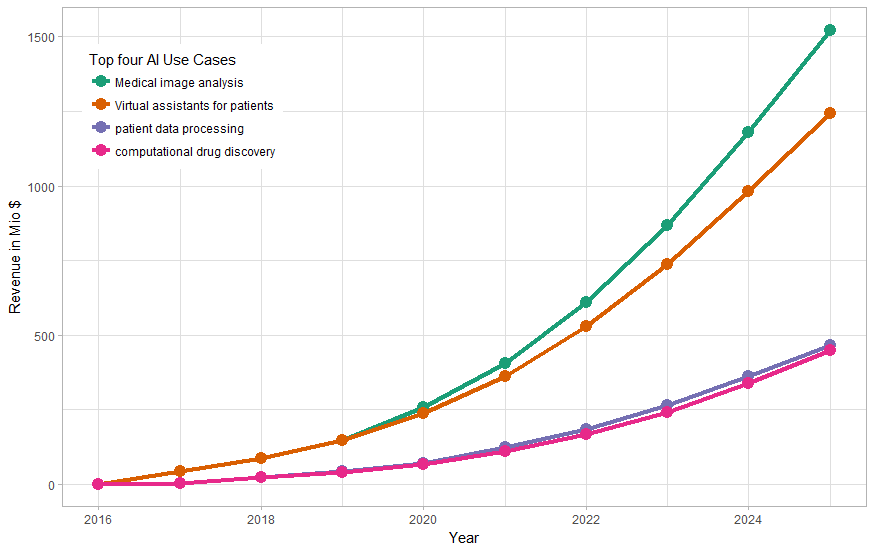
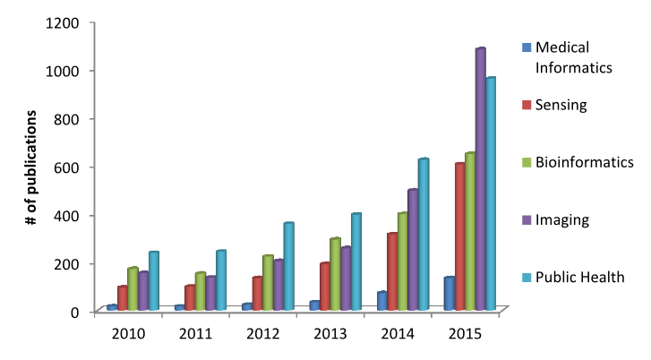

# Introduction

Artificial Intelligence (AI) and Cognitive Technologies are currently disrupting the market in a variety of different fields [@Newman.20170926, @Panetta.20180816]. The healthcare market is one of the most challenging fields AI Technology can be applied to. Applying artificial intelligence healthcare into healthcare systems is challenging because of two key factors. Primarily the patient privacy has to be the highest good when working with data and secondly do most applications require nearly perfect results to harm no persons life in direct or indirect manner [@Crawford.2018, @Miotto.2017]. The most  important use case by revenue in the healthcare is the medical image analysis [@fig:healthcare-use-case]. Since the breakthrough of deep neural networks for image processing in 2012[@Krizhevsky.2012], the technology is emerging for medical images as well [@Ravi.2017]. Research is focusing on deep learning for medical imaging as well [@fig:paper-healthcare] . According to Gardner this trend is currently at it peak of inflated expectations into the technology, but in contrast to machine learning technologies  not in the productive application. A major trend of this year  will be the democratization of AI use cases [@Panetta.20180816]. 

{#fig:healthcare-use-case width=30%}
{#fig:paper-healthcare width=30%}
![Hype Cycle for Emerging Technologies, 2018 [@Panetta.20180816]](images/Gardner_Hype_Cycle_2018.png){#fig:hype width=30%}

With a concrete deep learning implementation for different datasets does this thesis show how medical image analysis can be integrated into a medical context. The scope of this work is limited to object detection scenarios for two different publicly available datasets. Presented is not only how an deep learning algorithm is applied to the datasets, but also this application is integrated into a business context involving the challenges and restrictions of the current technologies. The result is an modular application that is completely deployable for two different medical use cases.

## Motivation and problem description

medicine one of the most important sciences for humans -> increasing life span

their join has and will revolutionize the field in science and application

Deep learning has been broadly adopted in the field of medical imaging [@Ravi.2017, @Litjens.2017, @Miotto.2017] and with the first FDA approval [@ArterysInc.2017, @USFoodandDrugAdministration.2017] the technology get integrated into the medical work environments. 
Image analysis in the medical field does implies different techniques such as classification, detection or segmentation. The applicability of classification algorithms into medical application has already been proven [@Ravi.2017], segmentation and detection are still challenging. The problem description of segmentation and detection is in general more sophisticated. Datasets for these applications are still rare and often not publicly available. Research in this areas does focus on finding the best algorithms for a specific kind of data and besides some commercial products deep learning infrastructures have not been explored for medical environments. 
With the rise of neural networks, the algorithms did become flexible enough to adapt towards different kinds datasets. This opens the opportunity to develop an application training itself one different kinds of datasets, without the need of building a new model for each dataset.  To the best of the authors knowledge this has not been tried so far.
There is no question of specialized algorithms performing better on different datasets. However developing these algorithms does cost development time and especially money. With a view on the situation of public hospitals in Germany it can be seen, that money is still a limiting factor toward innovations resulting in a innovation backlog. Lowering this barrier might improve the adoption of new supporting technology [@Arens.2018, @Schlingensiepen.2018].

The goal of this thesis is the ...

many existing algorithms which fit best purpose

however special use cases first general and flexible for multiple datasets easy to use plug and play for new datasets

object detection still quite rare and if datasets not publicly available

exists a lot of prototypes

closed dataset machine learning is used

restriction to bring prototypes into market

many algorithms, fast emerging

provide a comprahesiv over view of algorithms

apply one stable and flexible algorithm from one of these to multiple datasets

find datasets

flexible framework if the chosen algorithm gets at one point outdated

finally implement this algorithm to provide a prototype ready for implementation

not soly show how working, also industry and deep learning architecture

challanges, problems difficulties  ML service EU data privacy

discuss challenges, limited to dataset uses one algorithm, show how integrated into environment

## State of scientific research and goal of the Thesis

## Methods used in the thesis

## Structure and delimitation of the thesis

Reader requires Knowledge about:

- Machine Learning 
- Basics of Computer Vision
- Neural Networks
