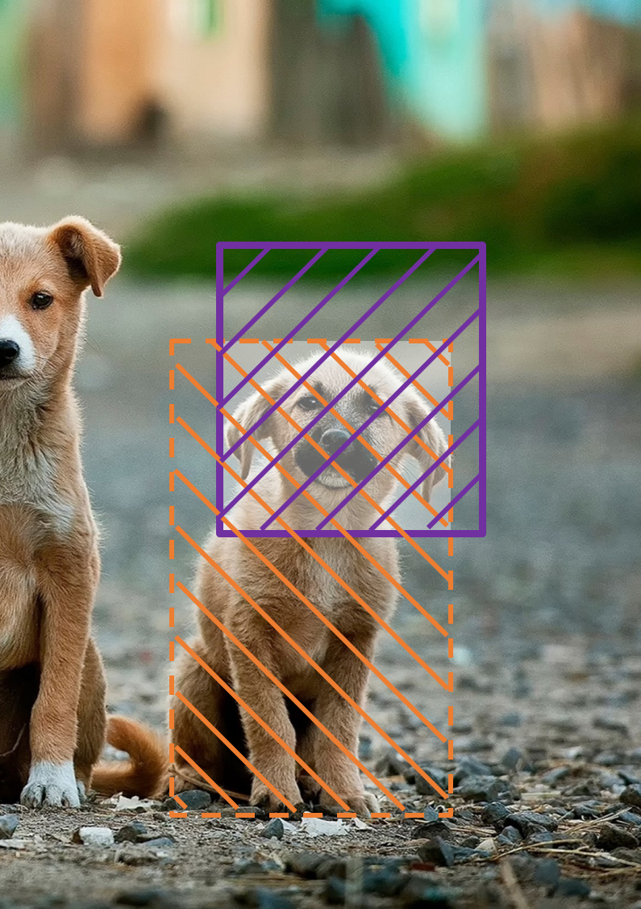
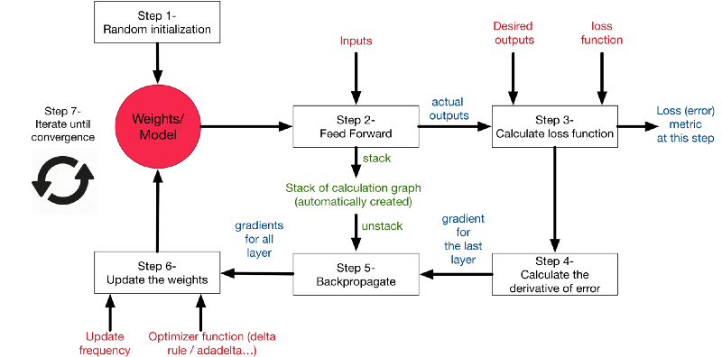
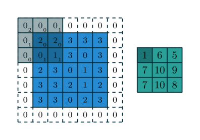
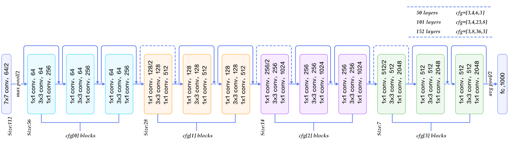
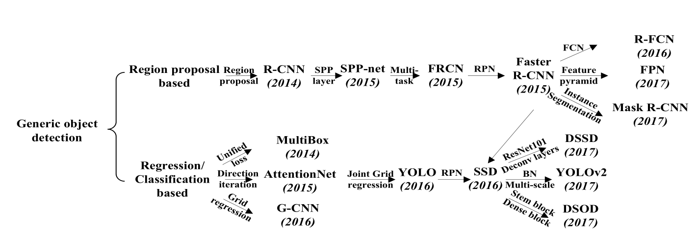

#  Technologies for processing medical images 

The field of Computer Vision (CV) represents the technologies used for processing medical images. Computer Vision is "a broad term for the processing of image data" [@Fisher.2005, p. 47]. It distinguishes from terms like mage processing or pattern recognition with a focus on the human perception of what the understanding of an image means  [@Fisher.2005, p. 47]. 
The described application requires *segmentation* and *recognition* algorithms from this field of computer science. This chapter introduces the reader in the basic concepts of these two algorithm areas and presents the current state of research. The focus lies only on algorithms the can be used for medical images.

<!-- The foundation for this chapter is build on an extensive literature review, using the databases of arvix and google scholar. The literature review does focus on CV algorithms and known medical applications. -->

## Machine Learning for medical image analysis 

With Machine Learning (ML) computer vision did become even more powerful [@Freeman.2008], to that a variety of problems can be solved using ML algorithms [@Szeliski.2011, p. 5]. This section provides a short introduction into segmentation and recognition algorithms and contains the  basic terminology of the relevant CV algorithms. Thereby the relevance of object recognition in contrast to simple classification will be highlighted. <!-- The presented knowledge is a compilation from standard computer vision literature, for more detailed explainations please consult the books of .. -->

### Terminology of Computer Vision tasks

*Segmentation* denotes the process of dividing a data set into parts based on defined rules [@Fisher.2005, p. 229]. In the context of computer vision the image segmentation implies the grouping of the image pixels into reasonable structures like edges or regions [@Fisher.2005, p. 117]. These regions are also called segments [@Klette.2014, p. 167].

*Object recognition* is a closely related task with a definition focus on identifying one or more known objects in the image [@Fisher.2005, p. 172]. If this process includes also the objects scene position, it is an object detection process. An generic *object detection system* is based on three steps. Initially the system performs a *localization* of *object candidates*. These candidates are commonly bounding boxes. Bounding boxes are a special case of a region of interest (RoI) being the smallest rectangular frame around an object  [@Fisher.2005, p. 31]. In the second stage the boxes are mapped by an classification algorithm into sets of detected objects or rejected candidates. Which sets are finally used for evaluating the algorithms performance. [@Klette.2014, p. 375] <!-- Whats is classification/Math -->
Using classification algorithms directly without a prior splitting in sub regions makes the detection of multiple objects within one image impossible. Using regions of interest has also two other advantages for the regarded use case. RoI do reduce the amount of computation needed and therefore improve the speed on larger images and these regions minimize the distractions for the classification algorithm [@Fisher.2005, p. 215]. 

As further explained in the previous chapter the image source for this use case have been high resolution scans and photography's with multiple relevant objects which are technical reasons to use object detection. From a physician point of view object detection is helpful to understand to focus reduce object shaking in a time series. Even tough segmentation can be applied afterwards, it might distract the analyst in this specific scenario. Therefore this paper uses an object detection system and will not focus on segmentation algorithms. <!--source + nicht gut durchgebründet, da use case unklar-->

In general object recognition divides into two broader categories: instance recognition and class recognition. 
Instance recognition or instance-level recognition  is are technics to re-recognizing objects by abstracting different scaling, viewpoints, lightning and other aspects of the picture [@Szeliski.2011, p.685]. Commonly these algorithms classify using viewpoint-invariant 2D features [@Vedaldi.2018, @Szeliski.2011 p.685f].  This works pretty good to recognize popular buildings or known faces. <!--but for faces = limitation source Google Googles key point extraction-->
Class recognition, also known as category-level or generic object recognition aims to solve more abstract problem of matching any instance of a generic class. This task is harder to solve. For example having a picture of a pug[^dog] and a terrier even both are kinds of dogs single instance extraction from the image might not be optimal because the dogs look completely different. 

[^dog]: kind of dog

The goal of our client is a stable and general algorithm for it's datasets. 
Recent scientific research does also focus on generic object recognition, since latest publications show that deep learning generic object detection does outperform, classical machine learning if if uses as instance recognition. Therefore the paper will focus mostly on the category object detection algorithms. 

<!-- what are requirements for deep learning to work https://arxiv.org/pdf/1807.04950.pdf -->

### Differences in machine learning approaches for computer vision

Besides the scientific claims Computer Vision tasks have a big engineering part as well. By this meaning multiple algorithms and approaches should be considered. Statistical approaches have been proven to be a useful way to solve Computer Vision problems <!--source -->. Therefore statistical approaches and classic machine learning algorithms will presented ahead, before diving into complex class recognition algorithms, which will require deep learning. <!-- ML = only instance recognition no see pedestrian detection--> <!-- compare ML and DL also to understand heading--> <!-- or more likely supervised vs. unsupervised --><!-- goodfellow 23 -->

Machine Learning in the context of medical image analysis has been quite common in past years, until it was gradually replaced by deep learning <!--source-->. Many common medical applications rely on machine learning algorithms.<!-- name some example + they have to be common + paper of methods --> This rather helpful since most medical applications provide only a small set of images.<!--medical image database, for validation --> In these use cases applying deep learning, if even possible, can only be achieved various strategies like using pretrained weights for non medical images or utilizing data augmentation [@Shen.2017, p. 223]. To baseline the score of the deep learning models well proven classical machine learning models should be used. Therefore supervised machine learning provides a good alternative. Therefore supervised machine learning with handcrafted features is a valid alternative to unsupervised object detectors. The next section will solely review the supervised object detectors, that have been proven in a medial application. <!-- handcrafted vs supervised--><!--source--> <!-- speak about common error rate of 25 % https://en.wikipedia.org/wiki/ImageNet -->

### Performance evaluation of Computer Vision algorithms

The overall goal of a computer vision algorithms is to perform as good as the human eye. But a generic algorithm that matches this goal in all possible task has not been published yet. So how should current object detection algorithm are measured? A common computer vision algorithm is evaluated on three categories [@Jahne.2000, p. 6]: 

*Successful solution of task* - It is the main goal to solve the given problem. Based on the kind of task the algorithms should be chosen, not otherwise. To provide a solid ground for decisions the next chapters [@sec:machine-object, @sec:deep-object] will discuss the different algorithms applicable for this thesis use case.
*Accuracy* - The algorithm solution should provide detections that overlap with the ground truth. The result need to be stable under different circumstances without under- or overfitting.
*Speed* - The time and the number of binary operations that are necessary to predict one image determines if the algorithm is applicable for a certain use case or environment.

In general algorithms have to find a tradeoff between accuracy and speed. State-of-the-art object detection algorithms with an higher accuracy are commonly slower than competitors [@Canziani.2016].
As the speed of a detector can simply be measured by the time for one prediction or the frame rate  in real time solutions the accuracy is measured by statistical methods presented in the following.

#### Measuring accuracy for object detection algorithms {#sec:acc}

<!-- cite also https://www.cs.umd.edu/~ozdemir/papers/prl_evaluation.pdf -->

So how is the accuracy for one dataset measured. Object detection <!-- paper unsupervised OD networks --> need a ground truth. The ground truth is measured or annotated data, which is considered to be reasonably accurate [@Klette.2014, p. 162]. The data is randomly spitted in the training and test set, by a common ratio such as 80-20. <!--ource for split --> The algorithms proposals should overlap with the reference data from the test set.

{#fig:ground-trouth width=200px }
{#fig:IoU height=200px}

Measuring accuracy for object detection algorithms
​    

<!--
  
-->

The overlapping of ground truth and proposal is calculated with the Intersection over Union (IoU) [@Everingham.2010, @Lin.2014]. The IoU is defined as follow, with the proposed box $B_p$ and ground truth $B_{gt}$ [@Klette.2014, @Awad.2016, p.39f]. 
<!-- Use icons to simbolize from here https://www.pyimagesearch.com/2016/11/07/intersection-over-union-iou-for-object-detection/ -->
$$
IoU^{truth}_{pred} = \frac{A (B_p \cap B_{gt})}{A (B_p \cup B_{gt})}
$$

If $IoU^{truth}_{pred} > 0.5$ the object considered as correctly detected. Whit the IoU the complete test can be evaluated, resulting in a basic confusion matrix of ground truth vs predictions. Using this matrix four unique labels can be assign to the objects (see fig xy). <!--source -->
The predictions (positives) split the numbers of true-positives $tp$ or false-positives $fp$. The undetected objects
analogously into true-negatives $tn$ or false-negatives $fn$. Since most dataset do not annotate negative examples, the $tn$ are often zero. Based on these numbers several metrics are constructed. [@Klette.2014]
<!-- parallel formulars -->
$$
p = \frac{tp}{tp+fp} \\ r = \frac{tp}{tp+fn}
$$
The precision $p$ measures how much of the predictions are correct [@Manning.2005, p.268]. The recall $r$ on the other hand shows which ratio of the ground truth is correct classified [@Manning.2005, p.268f]. The relation of precision and recall is typically a tradeoff. If for example all possible objects are chosen, the recall tends against one, where as the precision is very low. This tradeoff can be plotted as a precision-recall (PR) curve, which is used to calculate the average precision <!-- show such a plot? -->.  [@Klette.2014] <!-- https://en.wikipedia.org/wiki/Precision_and_recall -->

$$
\int_0^1 p(r) dr  \approx \sum_{k=1}^N P(k)\Delta r(k)
$$
The average precision (AP) also called the mean  average precision (mAP) is the precision averaged over all values of the recall or basically the area under the PR curve (see form xy). This is approximated as the sum over all precisions at every possible IoU threshold value ($P$), multiplied with the change in the recall $\Delta r$ for all $N$ images [@McCann.2011]. The thresholds depend on the challenges. PASCAL VOC uses a mAP at $IoU=.50$ denoted as $AP_{50}$. Common object detection algorithms are competing in  COCOs standard mAP uses 10 different thresholds at $IoU=.50:.05:.95$ [@Dollar.2018].

### Supervised object detection with manual feature engineering {#sec:machine-object}

The build of a supervised object detection system requires the definition of multiple abstract pipeline steps shown in figure 3.1. [@Szeliski.2011, p. 697]. In the last step of classification an algorithms for either instance or class recognition can be applied. Each previous step has to be engineered based on the dataset. Therefore multiple algorithms are available, the most important will be briefly introduced afterwards.

For a general understanding of these algorithms some key terms of CV and ML should be clarified. 
A *key point* (also named interest point) is an image coordinate surrounded by particular image intensities, like edges [@Klette.2014, p.333]. Each key point has a descriptor summarizing its properties.
*Descriptors* are the numerical representations derived from measured or calculated image properties. Each descriptor $x = (x_1, \dots , x_n) $ points into an n-dimensional real space $R_n$, called the descriptor space. In the general context of classification descriptors are called features. The term descriptor is used to avoid the disambiguity with the *image feature* composed by one more key points and descriptors. [@Klette.2014] <!-- example??, image?--><!-- rel. descriptior <-> feature-->
The *Classifier* has the task to assign class numbers to the descriptors, with the aim to find the final image features. In the initial step it applies the classes to the descripts from the learning set. With every training step then to the new generated descriptors. This process is called *classification*. <!-- todo other general ML book -->
The algorithm of defining or training the classifier is called the *Learning algorithm*. Such an algorithm can also perform an statistical combination of multiple weak classifiers into one strong classifier. <!-- source -->

{width=70%	}

#### Image Preprocessing

Most detector algorithms performing best under specific circumstances. To make use of there optimal performance ratio the images are often preprocessed. The preprocessing does involve basic operations like cropping, up- or downscaling or color space conversion. It can have a tremendous impact on the results as shown by Johansson et al [@Johansson.2016, p. 6ff]. Preprocessing is also required for most neural networks <!-- source--> . 

#### Key Patch detection and Feature Extraction

The detection of objects in images does require key features to find and distinct theses objects. Therefore classical image analysis will derive image descriptors in the first step of each training pipeline. Image descriptors have different ranges of complexity and can also be an assemblement of multiple simpler detectors. 
Descriptors can be used to extract local and global features. Global feature represent properties of the image such as width or brightness, local features on the other hand are derived by detecting key points in the image and describing the area around these points. [@Tuytelaars.2007, @Awad.2016, p.13f]
The sematic context and localization of anchor points makes local features much more important for object detection [@Tuytelaars.2007]. Therefore only the key algorithms for local feature detection and description are presented here. Many works reviewed these algorithms and since a complete review of all algorithms exceeds the scope of this work, only the common algorithms of these reviews will be presented in this section. [@Zhang.2006, @Materka.1998, @Ojha.2015, @Mukherjee.2013, @Uchida.2016, @Remondino.2006]
<!-- Characteristics why importantA Comparative Experimental Study of Image Feature Detectors and Descriptors, -->
Feature descriptors and detectors a two kinds of different algorithms. *Detector*s chooses 2D locations, like points or regions, if these locations are geometrically  stable  under different transformations and containing high information content, like the  local maximum of a cornerness metric. The results of the algorithms are 'interest points', 'corners', 'affine  regions' or 'invariant regions' that are stable under different transformations. A *descriptor* on the other hand is a 2D vector of pixel information, which describes the image patch around the position provided by an detector. [@Remondino.2006, @Canclini.2013, @Uchida.2016]
Together the image-patch and its descriptor build a local feature. These features are then used for computer vision tasks,like classification segmentation or detection [@Klette.2014, @Canclini.2013].

##### Detectors for interest point, corners or regions

Over the last fourth years since the the first corner detection algorithms (source) many scientist have been developing algorithms for different use cases.  So there are different way to sort these algorithms in these field as well. Some reviews distinct these algorithms based on their internal algorithm operations as contour curvature based, intensity based, color-based methods, (parametric) models based or machine learning methods [@Schmid.2000, @Tuytelaars.2007, @Lenc.2018]. Other papers group based on the detectors characteristics like viewpoint invariant, affine-invariant, scale-invariant or rotation-invariant [@Uchida.2016]. Since this work will not actually go into the detailed implementation of these algorithms and the methods are presented for a general overview, the outlined methods are divided by there application [@Canclini.2013, @Remondino.2006, @Ojha.2015].

<!-- einfache aufspaltung nicht hilfreich für komplexe -->

<!-- The field of detectors is a very large one which makes it hardly possible to provide a complete outline -->

<!-- Corner detection -->

<!-- [*Harris Corner Detection*](https://docs.opencv.org/3.0-beta/doc/py_tutorials/py_feature2d/py_features_harris/py_features_harris.html#harris-corners); [*Shi-Tomasi Corner Detector & Good Features to Track*](https://docs.opencv.org/3.0-beta/doc/py_tutorials/py_feature2d/py_shi_tomasi/py_shi_tomasi.html#shi-tomasi); [*FAST Algorithm for Corner Detection*](https://docs.opencv.org/3.0-beta/doc/py_tutorials/py_feature2d/py_fast/py_fast.html#fast);  Canny edge detector -->

<!-- Edge detection, Ridges, Blobs,  Regions-->

<!-- DoG detector--><!-- MSER  detector -->

<!-- CENSURE (Center Surround Extremas) TILDE-T, TCDET-S, LIFT-S, DNET-T, DNET-S. DNET-S ,SHOT (2014) -->

<!-- What are image moments? -->

<!-- http://home.deib.polimi.it/cesana/publications/conferences/PDF/CancliniDSP2013.pdf -->

<!-- Image Anomalies:  a Review and Synthesis of Detection Methods -->

<!-- What are Affine regions -->

<!-- https://www.embedded-vision.com/sites/default/files/apress/computervisionmetrics/chapter6/9781430259299_Ch06.pdf -->

<!-- https://en.wikipedia.org/wiki/Feature_detection_(computer_vision) -->

<!-- **GLOH** (**Gradient Location and Orientation Histogram**) -->

<!-- Evaluation of Interest Point Detectors https://hal.inria.fr/file/index/docid/548302/filename/Schmid-ijcv00.pdf -->

<!-- Fast Circle Detection Using Gradient Pair Vectors:  http://staff.itee.uq.edu.au/lovell/aprs/dicta2003/pdf/0879.pdf -->

<!-- Fast algorithm for Multiple-Circle detection on images using Learning Automata https://arxiv.org/ftp/arxiv/papers/1405/1405.5531.pdf -->

##### Image Descriptors

<!-- What are Local Binary Descriptors -->

<!-- This family of descriptors represents features as binary bit vectors. To compute the features, image pixel point-pairs are compared and the results are stored as binary values in a vector. -->

Once the locations of features in the image have been detected, the require a description or a context to find the same locations in other images (also called feature matching) [@opencvdevteam.2014]. This process is also called the feature extraction, which is a common part of a common image analysis pipeline. Main importance for a robust object detection is the descriptors invariance for transformations [@Mukherjee.2015]. 
Even tough descriptors can be distingue by there algorithms [@Mikolajczyk.2003, @Tombari.2013], it will not be of importance in this section. This section will simply introduce the most recent and common feature descriptors based on the reviews: [@Tafti.2017, @Tareen.2018, @Karami.2017, @Lenc.2018, @Guo.2016].

<!-- noch dazu? https://link.springer.com/content/pdf/10.1007%2Fs00138-015-0679-9.pdf -->

**SIFT** - The Scale-Invariant Feature Transform (SIFT) descriptor is still very popular even since it has been proposed in 1999 and completely released in 2004. The SIFT algorithm contains both, the key point localization and its description. The Difference-of-Gaussians (DoG) is used as approximation the Laplacian of Gaussian (LoG) to find local maxima at different scales of the image. The descriptor analysis the 16² surrounding area of the key point. This area is then split in 16 block of 4² size, where a 8 bin orientation histogram is created for each. This gives a total of 128 bin values.<!--source -->
The algorithm has been proven to be invariant to image rotations, scale, and limited affine variations, where it does even outperform even newer algorithms [@Tareen.2018].  The main drawbacks of SIFT are the high computational cost and its patent.  <!--source -->
<!-- formel ??? -->

**SURF** - Speeded Up Robust Features (SURF), developed in 2008, addresses the main issue of SIFT as being to slow for real time applications <!--source -->. Instead of the DoG approximation SURF uses the  determinant of Hessian matrix for the different scales and location. For each determinant uses four convolutions with box filters as LoG approximation, which can be calculated in parallel for different scales using integral images. As descriptor, SURF uses 64 or 128 bin values based on a distribution of  Haar-like features, which is a more time-efficient way of calculating the  weighted sums in rectangular sub windows.<!--source -->
The SURF features are invariant to rotation and scale as well, but are more sensitive to viewpoint changes.

**ORB** - Oriented FAST and Rotated BRIEF (ORB) has been developed in 2011 as patent free alternative to SURF and SIFT. As supposed by its name, ORB combines the  FAST key point detector and the BRIEF descriptor. It localizes corner key points with FAST and filters find top points using the Harris corner measure. Since FAST does not calculate the orientation ORB computes a intensity weighted centroid of the surrounding patch and the vector between centroid and key point notes the orientation. The BRIEF descriptor performs badly on rotation as well wherefore ORB introduced a modified version of BRIEF called rBRIEF.<!--source --><!--source -->
ORB features are very accurate under geometric transformations, even tough some descriptors are performing better on scale changes. ORB is also one of the fastest algorithms. <!-- scale space pyramid? -->

<!--**BRISK** - The algorithm Binary Robust Invariant Scalable Keypoints (BRISK), which was developed in 2011, is also based on corner detection. It uses the key points of the AGAST algorithm filtered by the same  FAST Corner score. --><!-- what is the FAST corner score? is it really the same? --><!--source -->

<!-- Binary Robust Invariant
Scalable Keypoints (BRISK) in 2011 [18], which detects
corners using AGAST algorithm and filters them with FAST
Corner score while searching for maxima in the scale space
pyramid. BRISK description is based on identifying the
characteristic direction of each feature for achieving rotation
invariance. To cater illumination invariance results of simple
brightness tests are also concatenated and the descriptor is
constructed as a binary string. BRISK features are invariant to
scale, rotation, and limited affine changes.-->

<!--**KAZE** 2013 -->

 <!-- KAZE features in
2013 that exploit non-linear scale space through non-linear
diffusion filtering [15]. This makes blurring in images locally
adaptive to feature-points, thus reducing noise and
simultaneously retaining the boundaries of regions in subject
images. KAZE detector is based on scale normalized
determinant of Hessian Matrix which is computed at multiple
scale levels. The maxima of detector response are picked up as
feature-points using a moving window. Feature description
introduces the property of rotation invariance by finding
dominant orientation in a circular neighborhood around each
detected feature. KAZE features are invariant to rotation,
scale, limited affine and have more distinctiveness at varying
scales with the cost of moderate increase in computational
time. -->

<!-- **AKAZE** 2013 -->

<!-- Accelerated-KAZE
(AKAZE) algorithm in 2013 [16], which is also based on non-
linear diffusion filtering like KAZE but its non-linear scale
spaces are constructed using a computationally efficient
framework called Fast Explicit Diffusion (FED). The AKAZE
detector is based on the determinant of Hessian Matrix.
Rotation invariance quality is improved using Scharr filters.
Maxima of the detector responses in spatial locations are
picked up as feature-points. Descriptor of AKAZE is based on
Modified Local Difference Binary (MLDB) algorithm which is
also highly efficient. AKAZE features are invariant to scale,
rotation, limited affine and have more distinctiveness at
varying scales because of nonlinear scale spaces. -->

<!-- **Newer ML or DL Detectors** - TCNEt (2017)- DDNET, CovDet, T-P24 The table also reports their evaluation speed, as this is often a key parameter in applications.  Unfortunately, for more recent works [9, 26, 30], the source code was not available at the time of publication. Not independently proven in different datasets -> viewpoint = problem, HPSequences learned like lift whit rise of cnn new serval new established not all independently tested -->

<!-- Hes-A [15] Learning covariant feature detectors.  In ECCV Workshop on Geometry Meets Deep Learning, 2016. [39] Learning discriminative and transformation covariant local feature detectors.  In Proceedings of the IEEE Conference on Computer Vision and Pattern Recognition, pages 6818--6826, 2017 Harris affine region detector 2002 An affine invariant interest point detector. In Proceedings of the European Conference on Computer Vision, pages 128--142. Springer-Verlag, 2002 tasks where a viewpoint invariance is important.  -->

<!-- **LIFT** 2016-->

<!-- s. Early attempts used genetic programming [25, 33]. More recently, Yi et al. [38] learn to estimate the orientation of feature points using deep learning.  A related approach is the TILDE detector [36] for illumination invariance. The LIFT framework [37] aims at learning detector, descriptor and orientation estimation jointly using patches, while SuperPoint [9] uses full images. Another approach to unsupervised learning of keypoint detectors is DNET[15], which is trained using the covariance constraint and no supervision.   A version of this detector is TCDET [39], combined geometry and appearance losses.  The covariant constraint is extended for affine adaptation in [24]. -->

<!--http://openaccess.thecvf.com/content_cvpr_2017/papers/Zhang_Learning_Discriminative_and_CVPR_2017_paper.pdf -->

<!-- **Other** besides the standard detectors for corners and blobs other like houh circle transform? Thrift: Local 3D Structure Recognition -->

<!-- CONTENT- BASED image retrieval (CBIR) -->

<!-- what is data fusion -->

<!-- completly differnet https://arxiv.org/pdf/1808.02564.pdf -->

##### Feature Classification Algorithms

The more high level object detection algorithms do classify the image features with different algorithms. This section aims to provide a short overview how the three most popular algorithms for machine learning based object detection work. Classification  algorithms commonly used are Support Vector Machines (SVM), Adaboost and Random Decision Forest. 

Support Vector Machines is a classification algorithm which defines a linear separation line called a hyperplane trough the data (see fig xy). SVM  chooses the hyperplane that maximizes the margin around the separation line, which is defined as $w * x + b = 0$. The hyperplane margin to both sides is defined by two boundaries with the distance of $d_+$or $d_{-}$, restricted by the $x$ elements closest to the boundary, with $w \cdot x + b \geq a$ with $a \in \{1,-1\}$ for an upper boundary or the negative for the lower one. The points on these boundaries are called the support vectors. The margin can be defined as $1 / \| \boldsymbol{w} \|$ and is part of an maximizing problem to find the thickest boundary. SVM minimizes the objective $\| \boldsymbol{w}\|^2$, because its a convex function and therefor better to solve. 
Many datasets it are not easily separable because they include outliner disturbing the segmentation. SVM solves the non-separable problem by introducing slack variables $\xi_i$ and a cost parameter $C$. Each $\xi_i$ hold the distance towards it's bounding barrier and optimizes the function $(1/2) \| w\|^2 + C \sum_i^m \xi_i$. A larger penalty, meaning a larger C, includes resolves in a more stable SVM having more misclassifications (lower bias, higher variance) and vice versa for small $C$. Implementations, like  Sequential Minimal Optimization, for solving the optimization problems use the Lagrangian $\mathcal{L}$ formulation.
No every dataset can be divided by linear functions (see. fig xy). Therefore SVM's do use the so called "kernel trick", if data can not be separated in the current dimension it might be separable by adding an additional dimension.
<!-- cite: http://efavdb.com/svm-classification/, http://cs229.stanford.edu/notes/cs229-notes3.pdf -->

<!-- SVM: http://jcb.rupress.org/content/jcb/early/2016/12/08/jcb.201610026.full.pdf -->
Object Detection is often a combination of different characteristic features of the image. Most classifiers do detect only a single feature or image patch. By the use of boosting multiple weak classifiers can be combined to into one stronger. Instead of using only a single of the previous described image descriptors is used, boosting algorithms allow their combination in various ways (fig xy). 

The *adaptive boosting*  or short AdaBoost is a concrete algorithms for training a boosted classifier. 

$$
F_T(x) = \sum_{t=1}^T f_t(x)
$$

The classifier $F_T(x)$ is the combination of all weak classifiers $f_t(x) = \alpha_t h(x)$. Each weak classifier produces a hypothesis $h(x_i)$ for each sample of the input $x$. To influence the hypothesis an coefficient $\alpha_t = \frac{1}{2}ln(\frac{1-\epsilon_t}{\epsilon_t})$ is introduced. $\epsilon_t$ denotes the error rate, leaving $\alpha_t$ the error distribution. By plotting $\alpha_t$ for different classifier error rates, the graph shows that the weight $\alpha_t$ grows exponentially as the error trends against zero (fig xy). 
So for training the next classifier the next weights $D_{t+1}(i)$ are updated by the new classifier in formula xy.
$$
D_{t+1}(i)=\frac{D_{t}(i)\exp(-\alpha_ty_ih_t(x_i))}{Z_{t}}
$$
<!-- http://mccormickml.com/2013/12/13/adaboost-tutorial/ - http://www.inf.fu-berlin.de/inst/ag-ki/adaboost4.pdf -->

Another approach for combining different image descriptors are Random Decision Forests (RDF). RDF is based on a statistical method called bagging, which is the short term for bootstrap aggregating. Bootstrapping estimates the  data sample using some descriptive statistic, like mean or standard derivation. Based on that a large number of random  sub-samples $S$ for this dataset is artificially created. For all decision trees $T_j, 1 ≤ j ≤ w$ a random sub-sample is chosen to train the tree.  The selection of a random sub-sample is represented as $S_j = S_{j,0}\cup \bigcup_{d=1}^{k} S_{j,d} ⊂ S_t$ with the samples $S_0$ not an class and $S_d$ part of class $d$. Each tree represents a weak classifier. The different random trees give the algorithms the name of the random forest.
The aggregation part in bagging combines the different classifiers in the following way. Each image $I$ is passed as an input for the tree $T_i$. At each node the the decision divides by the split function $ h φ (I)$. 
<!-- Different actual implementation -->

##### Object detection approaches

In medical image analysis multiple different approaches have been proven to provide good results. These algorithms divide in three kinds of models. The first are follow the idea of visual words (Source Book) behaving like bag of words featured systems. Based on these key features one of the previous described classifiers is used to decide on a class. The secondary approach are part-based models. Part-based models do recognize objects by their geometric relations are not discussed in this thesis since they have not been applied for medical images in the recent years (algorithms and applications). The latter use the an approach called sliding windows (also called windowing), where the image is divided small sub images (patches) for which the detection of classes will be performed (def book). <!-- define patches-->

<!--hog, har wavelets, Haar feature-based cascade classifiers, backwards form 2012 to Dalal and Triggs 2005, Deformable Part-based Model (DPM) [30] are good choices. --><!--https://arxiv.org/pdf/1807.05511.pdf --> <!-- MRF vs. SVM vs. RDF: http://jcb.rupress.org/content/jcb/early/2016/12/08/jcb.201610026.full.pdf -->

<!--On difficult datasets deformable part models are often
outperformed by simpler models such as rigid templates
[10] or bag-of-features [44] DPM paper The Dalal-Triggs detector [10] -->

<!-- Evaluation of FD is important [@Awad.2016, p. 1] -->

<!-- Image descriptor algorithms commonly specialize on the detection of specific image attributes. <!--source image descriptor attributes  Most descriptors fit in the following distinction of attributes [@Ojha.2015]: -->

<!-- giving an complete overview about all algorithms, which can be used in each step of this pipeline outranges the scope of this thesis. Therefore for each step only a short overview about the most important technics in the medical context is given. -->

<!-- category recognition is the bag of words (also known as bag of features or bag of keypoints) approach --><!-- image from book ? -->

<!-- These can be convolutions or integrals over the images -> kernel is for convolutions -->

<!-- A visual words can implement multiple models and the models there self can vary in there kernel functions --><!-- define kernel + kernel function --> 

<!-- see ML vs DL final word in sources -->

<!-- This technique works by partitioning the image into increasingly fine sub-regions and computing histograms of local  features  found  inside  each  sub-region.   The  resulting “spatial pyramid” is a simple and computationally efficient extension of an orderless bag-of-features image representation,  and  it  shows  significantly  improved  performance on challenging scene categorization tasks. (Beyond Bags of Features: Spatial Pyramid Matching for Recognizing Natural Scene Categories)-->

<!-- Dictionary learning and sparse representation   https://www.nature.com/articles/s41598-017-15720-y -->

<!-- +++ concrete papers of medical to show that with results https://arxiv.org/pdf/1706.01513.pdf -->

<!-- Spatial Distance -->

<!-- Weighted Fuzzy C-Means (SDWFCM) of Guo et al. [2], Dictionary-based Model (DICT) of Dahl and Larser [3] and Convolutional Neural Network (CNN) https://arxiv.org/pdf/1610.09493.pdf -->

<!-- As shown in paper Holger this general imaging pipeline can be extended und verfeinert based on the use cases -->

<!-- While  sliding  window  approaches  never  completely disappeared, they had gone out of favor after the heydays of HOG [4] and DPM [7] -->

#### Post-processing detected objects

The last stage of object detection pipelines is often some kind of post-processing to filter false detections based on use case specific rules<!-- examples of post processing -->. A very common after detection optimization is called the *non-maximum suppression* (NMS). Object detection algorithms do often propose multiple possible bounding boxes for a single object [@fig:NMS].

{#fig:NMS-before width=45%}
{#fig:NMS-after width=45%}
​    
Non Maximum Suspression

How the NMS is implemented in detail depends on tasks the detection pipeline is used for.  The most commonly used NMS for generic object detection was proposed by Dalal and Triggs [@Dalal.2005] as the greedy NMS method. The greedy NMS algorithm chooses the box with the highest IoU score of its neighborhood and removes all other boxes [@Bodla.2017]. Although other alternatives, like Gnet  [@Hosang.2017] or IoU-Net [@Jiang.2018] have been proposed, greedy NMS is still implemented in state-of-the-art detectors evaluated by their average precision. Greedy NMS is still used because it has a low complexity to calculate where as learning based approaches like  [@Hosang.2017, @Hosang.2015] take more time. One newer alternative used by some recent detectors [@cornernet, @Papandreou.2017] <!--TODO look in all cornernet --> is Soft-NMS [@Bodla.2017]. It improves the AP especially for proposal based detectors, not so much for regression based [@Bodla.2017]. 

### Neural Nets for object detection{#sec:deep-object}

Even thought Machine Learning approaches have been proven to handle most imaging problems very well, the rise of neural networks seems to outperform these methods <!--source -->. All state-of-the-art algorithms in object detection are deep learning algorithms, commonly neural nets<!--source-->. This chapter will provide a brief introduction into neural nets, with the focus on convolutional neural nets.

#### General introduction in neural nets

The basic building blocks of neural networks is the mathematical model of the neutrons. A neutron (figure xy) can be expressed as the weighted sum of multiple input, which will fire if the sum exceeds a certain threshold.I single neuron takes a number of different inputs $x$ with  each having an assigned weight $w$. The bias $b$ is an additional input hardwired to the weight of 1. This sum $\sum_iw_ix_i + b$ can also be rewritten in a vectorized form:<!--source -->
$$
y = \sum_iw_ix_i + b = x_0 +w_1x_1 + ...w_nx_n = \begin{bmatrix}w_0&w_1&\dots&w_n\end{bmatrix} \begin{bmatrix}x_0\\x_1\\\dots\\x_n\end{bmatrix} = W^Tx
$$
$$
y= F(W^Tx)
$$

The sum above will validated by the activation function $F$, which drives the output in a certain direction based it's result passing the threshold.<!--source --><!--difference neuron <-> precepton actually not really relevant -->

Neural Networks architecture use multiple neurons organized in layers. Each neural network has at least an input and a output layer. Complex tasks do require one or more additional layers in between, which are then called hidden layers. A network with two or more hidden layers can be called a deep neural network <!--http://neuralnetworksanddeeplearning.com/chap1.html -->. The data will be feeded from one layer to the next until the final output provides some conceptual understanding, which gave the idea the name of a feedforward neural network. The main goal of such an networks is the approximation of a function $f^*$, so that  $y=f^*(x)$. <!-- fundamentals of deep learning -->

Training neural networks is commonly done by the use of the *backpropagation* algorithm. This algorithm is based on a error function like  gradient descent used in machine learning as well. The error function known as the loss or cost function. The algorithm can be implemented in  dynamic programming manner. It is known how fast the error changes if the hidden layer weights are changed. Based on this it can be count back how a weight of an individual connection changes the actually output. For each layer $j$ an error  derivative is build $\frac{1}{2}\sum_{j\in output}(t_j-y_j)^2 \implies \frac{\partial E}{\partial y_j} = -(t_j, y_j)$, in this sample the mean squared error is shown. From the shown fraction the next layer can be derived: $\frac{\partial E}{\partial y_i}= \sum_j w_{ij}y_j(1-y_j) \frac{\partial E}{\partial y_j}$.  Based on the error per layer the modification for each weight can be calculated: $\Delta w_{ij}= - \sum_{k\in dataset} ey^{(k)}_iy^{(k)}_j(1-y^{(k)}_j) \frac{\partial E^{(k)}}{\partial y^{(k)}_j}$. <!-- rewrite with http://neuralnetworksanddeeplearning.com/chap2.html --><!-- difference lost function cost function https://stats.stackexchange.com/questions/179026/objective-function-cost-function-loss-function-are-they-the-same-thing#179027 -->

<!-- different optimizer functions fike sgd, adam, ... https://arxiv.org/abs/1709.07417 -->

<!--Optimizers-->

<!--Activation function-->

#### Convolutional Neural Networks

Neural Networks have no general architecture build for every use case. Instead a wide variety of architectures does exists for different use cases {van Veen 2016 #49}. In the healthcare uses cases 5 architectures are very common recurrent neural networks (RNNs), bolzman machines (BM), deep belief networks (DBN), convolutional neural networks  (CNN) and Auto Encoders (AE) [@Ravi.2017] <!-- I definitly had a paper at hand showing only AE, CNN, DBN are relevant --> For image analysis purposes the last four can be used [@Hjelm.2016]. <!-- concrete example for algorithms ?? --> However it has been shown that CNN do have advantages over the other networks and should therefore used for general object detection tasks [@Zhao.2018].<!-- example for advantages? --> Therefore the presented networks will solely rely on the convolutional neural network idea. <!-- architecture vs type -->

Convolutional Neural Networks exists since the 1980s <!--Safari NN and DL--> and have become popular with the introduction of the *LeNet-5*-Architecture<!-- source -->. In addition to simple deep neural networks CNN have two new building blocks: *convolutional layers* and *pooling layers*.<!--Safari NN and DL-->

<!-- This architecture allows the network to concentrate on low-level 
features in the first hidden layer, then assemble them into higher-level
features in the next hidden layer, and so on. This hierarchical structure is common in real-world images, which is one
of the reasons why CNNs work so well for image recognition.-->

##### Convolutional layers

Convolutional Neural Nets got their name from the convolution operation, which is used for feature extraction from the images. Every image can be represented as an matrix as shown in figure [@fig:conv-layer], in general as one matrix per channel. 

{#fig:raw-image width=200px }
{#fig:matrix-image height=200px}
{#fig:IoU height=200px}

Convolutional layers
​    

A convolutional operation uses such an matrix and slides with a quadratic kernel (also called a filter) over the image to derive a new matrix. <!-- where is the fucking math?? to be found, simple sum -->. Each possible position in the input matrix is elementwise multiplied with the kernel and summed up as one new pixel in the output frame: $\sum_{i-1}^{i+1}x_i$.  <!-- how does a filter look like -> ref to edge sobel filter -->
This way of convolution leads to two drawbacks.With each layer of convolutional operation the remaining matrix gets smaller, so that the number of layers is limited. The second issue is that features in the corners are likely to be ignored <!--stanford-->. Therefore a new parameter can be introduced the padding size $p$. For the size of $p$ the original matrix gets surrounded by an equivalent hull of zeros. <!-- better to speak of expand of matrix? --> To create an output matrix of a certain size another parameter, the striding size $s$ is used. The size of $s$ defines the  amount of  steps the filter takes to the next element. The result of the convolution operation with one filter is a feature map, which can also seen as a weighted matrices of neurons.

{#fig:onvolution-stride height=200px}
{#fig:convolution-stride height=200px}

Convolutional Operations
​    

Commonly multiple filters are used for each input to extract different features. And as consequence an input can also be a stack of matrices (also known as three dimensional tensor). Convolutions over these volumes are done in the similar manner with the difference that the depth dimension is also summed up. The output for each convolution will be again two dimensional. To apply this operation the depth of kernel and tensor have to be the same. 
So in general a layer $l$ is defined by the four parameters: filter size $f^{l}$, padding $p^{l}$, stride $s^{l}$ and number of filters $f_n^{l}$ which will define the shape of the new matrix of neurons. But in contrast to a fully connected layer these parameters define the connections to the next layer. Fully connected layers may be later in the network architecture used for classification or regression tasks, but would make the feature extraction not scalable <!-- give good example ? -->.  
While training the filter will be adjusted by adjusting the weights for each feature maps. Formula XY visualizes the output of each neuron $z_{i,j,k}$ in a three dimensional feature map. $x_{i',j',k'}$ denotes the input of the previous convolutional layer and $w_{u,v,k',k}$ the weighted connection between the layers, with $u$ and $v$ as relative coordinates to the neuron’s receptive field.
$$
z_{i,j,k} =b_k + \sum_{u=0}^{f_h-1} \sum_{v=0}^{f_w-1} \sum_{k'=0}^{f_n-1}  x_{i',j',k'} \cdot w_{} ~~~\textrm{with}~\{ \substack{i' = i\times s_h +u\\ j' = i\times s_w +v}
$$

##### Pooling layer

ConvNets use pooling layers for two basic reasons. Primarily these layers speed up the computation, but pooling can also make feature detection more robust. Pooling (also called subsampling or downsampling) simply reduces the dimension of a feature map. For each sub-window a accumulation function is used, like $max$, $avg$ or others.
Pooling requires no parameter learning and takes two parameters filter and striding size as shown in fig. xy

{#fig:pool width=50%} 
{#fig:maxpool width=50%} 

Pooling Layer

##### Convolutional base networks

Convolutional neural networks have existed for quite some time and therefore base architectures for different amounts of computing power have been proven to performing very well. The majority of current object detection networks is based or even uses these architectures for feature extraction. Therefore the networks still used will be introduced briefly.

<!--https://ujjwalkarn.me/2016/08/11/intuitive-explanation-convnets/ -->

A good reference architecture for convolution neural networks is called VGGNet [@Simonyan.2014]. This work originally showed that the depth of the network is a critical factor for good predictions [@Simonyan.2014]. The figure [@fig:CNN] presents the basic structure of an image classification and localization system based on the VGG architecture. The convolution and pooling layers are used for learning the image features [@fig:cnn-imagefeat]<!-- redraw/structure graphic -->. After the feature learning an the classification takes places using multiple fully connected layers. The softmax algorithm in the end assigns each class in a multi-class problem a probability based on the net output.  <!--https://developers.google.com/machine-learning/crash-course/multi-class-neural-networks/softmax --><!--explain softmax --> <!-- We can see that as we go deeper, the height and width decreases by a factor of 2 while the number of channels doubles.-->

<!-- speak also about first layers egdges, blabla, second part and last objects -->

![Feature visualisation per layer [@Wei.2015]](images/conv-layer.png){#fig:cnn-imagefeat}

Many base architecture like VGG are came up in the ImageNet competition ILSVRC [@Russakovsky.2014]. The contest was the major breakthrough for convolutional neural networks for image classification [@Russakovsky.2014] with the AlexNet  submission by Krizhevsky et al. [@Krizhevsky.2012]. Most current OD networks are based on the ResNet-101 [@He.2015] architecture from the 2015 winning submission [@Law.2018, @ILSVRC.2015]. Figure [@fig:ResNet] shows the configuration of this network. 

{#fig:ResNet}

There a only a few exceptions in the best object detection algorithms. The  base network for YOLOv2 (Darknet-19)  [@Redmon.2016] was inspired from 2014 winner GoogLenet[@Szegedy.2014] and include ideas from Network In Network[@Lin.2013], Inception[@Szegedy.2016], and Batch Normalization[@Ioffe.2015]. In YOLOv3 [@Redmon.2018] extended the DarkNet-19 model also with ideas from the ResNet[@He.2015] introducing a larger backend network called DarkNet-53. DSOD300[@Shen.2017] feature extraction is  based on 2016 published DenseNet[@Huang.2016]. The D-RFCN + SNIP configuration from [@Singh.2017] uses the Dual Path Network [@Chen.2017] from 2017 and CornerNet[@Law.2018] uses the Hourglass Network[@Newell.2016].

The usability of CNN architectures as backbone network for object detection does primarily depend on two features as shown in  [@Canziani.2016]: Accuracy (measured in mAP) and Performance indicated by operations per prediction. The have to be evaluated against each. A higher accuracy requires in general more layers, which does mean more operations and therefore a lower performance. 

 
    ![top accuracy of backbone networks [@Canziani.2016]]("images/1535493961987.png"){#fig:123 width=30%}
    ![accuracy per operation [@Canziani.2016]]("images/pratical-reasons.png"){#fig:123 width=30%}
    ![accuracy per network parameter [@Canziani.2016]]("images/top-1-accuracy.png"){#fig:123 width=30%}

<!-- go into detail for different techniques https://towardsdatascience.com/neural-network-architectures-156e5bad51ba -->

#### Object Detection Networks

<!-- has also many things: http://papers.nips.cc/paper/5207-deep-neural-networks-for-object-detection.pdf DetectorNet  
interesing DPM  and Fast, Accurate Detection of 100,000 Object Classes on a Single Machine  -->

With the rise of convolutional networks image classification, CNNs have also been used for the prior localization step. Even though network architectures have changed, ConvNets are still used for the complete object detection pipeline and perform a generic object recognition. With winning ImageNet 2012 object localization challenge AlexNet showed the capabilities of CNNs for how localisation tasks <!--source -->, even though they make no publications on their specific approach [@Sermanet.2013]. The OverFeat publication [@Sermanet.2013] defined the first state-of-the-art approach by winning 2013 challenge [@ILSVRC.2013, @Russakovsky.2014] and providing a concrete explanation how ConvNets implement object detection using a sliding-window approach.

Based on the networks introduced with AlexNet and OverFeat two different kinds of networks emerged as shown in figure **xy**: region proposal based and classification (or regression) based networks. The first has two stages generating region proposals first and classifying each proposal afterwards. The latter threats the detection as a regression or classification problem changing bounding boxes and classification in one stage.

{#fig:evo-cnn}

##### Region proposal network

Region proposal networks (RPNs) where introduced by Regions with CNN (R-CNN)[@Girshick.2013]. R-CNN main approach is it's modularity. One stage proposes possible regions and the next does classify these regions. The network is not determent to a specific region proposal or feature extraction method. For the ILSVRC2013 they implemented the region proposal with a selective search as shown in [@Uijlings.2013] and [@Wang.2015]. <!-- which uses itself the the powerful Bag-of-Words model for recognition and sparcial pyramid --> For feature extraction architecture AlexNet is commonly used, but for the VOC2007 and ILSVRC201 challenges they implemented VGG-16, which is slower but more accurate. For the actual classification linear SVM per class is used and overlapping bounding boxes are summarized by NMS thresholds.

#####  Classification/Regression based networks

[^yolo-refinedet]: Even tough it should be noted that the RefineDet  is more accurate on real time tasks using a Titan X GPU, YOLO has been chosen for a  variety of reasons explained at the end of the section.

Classification (or regression) based networks approaches for neural object detection networks where shown by many different networks based on AlexNet. This section aims to provide a brief overview over the development of one-stage detectors. The description might have a slight focus on YOLO, since it is the authors preferred network of choice for real time tasks [^yolo-refinedet]. As visualized in figure [@fig:evo-cnn], this section explains the current state-of-the-art networks based on their features development.
The DeepMultiBox, often called simply MultiBox, used a single NN by implementing a classifier known as Deformable  Part  Model (DPM) in a deep convolutional network [@Erhan.2013]. <!--Inside-outside net (ION), DetectorNet  <!--source  G-CNN <!--source -->
The AttentionNet was first to integrate a object existence estimation and bounding box optimization into a single convolutional network. With iterative predictions the net approximates an object. However the AttentionNet cloud only detect a single class per image.
G-CNN in contrast is able to detect multiple classes by splitting the image into a multi-scale regular grid. Each box is classified and afterwards corrected. After multiple iterations of regression the boxes are correct. The main problem of G-CNN are small or highly overlapping objects.

With its first version of YOLO introduced a new model inspired by the previous nets, but with a different architecture and a new way of regression for bounding boxes. The base architecture was inspired by the GoogLeNet using  24 Conv-layers and 2 fully connected layer together with an higher input dimension of $448\times 448$. The detection of objects is also grid based. The image is divided in a $S\times S$ grid and for each grid a single class $c \in C$ and $B$ bounding boxes, with a confidence score, are detected. The confidence of one box is defined as product of object probability with the ground truth intersection  over  union  (IOU) $Pr(Object)*IoU^{truth}_{pred}$. So the output tensor of predictions looks like: $S \times S \times (B*5+C)$. <!-- show training formular?? -->
The first version of YOLO has problems to detect small objects in groups, which is caused by size limitations in the bounding box predication. The algorithms struggles also with aspect ratios rarely seen in the training data, because the  features used for the BB predictions are relativly coarse. <!-- explain coarse and sparse -->

Based on previous approaches the Single Shot MultiBox Detector (SSD) introduced new features into single-stage detectors, mainly based on the Faster R-CNN improvements. SSD is based on the MultiBox [@Erhan.2013] network, but uses a VGG-16 network for the feature extraction. The SSD net has 3 major improvements in contrast to YOLOv1. Primarly it adds additional convolutional feature layers to the end of the truncated base network do detect objects on multiple scales of the feature map. Secondly the detections on the scaled layers are done with convolutional filters and the third improvement is the use of anchor boxes as proposed in Faster R-CNN. For each grid cell of the feature map predefined boxes are used, providing $(c + 4)\ k\ m\ n$ predictions for a $m \times n$ feature map with $c$ classes and maximal $k$ default boxes with $4$ coordinates each.
The use of anchor boxes and detection on multiple scales solves the aspect ratios issues of previous solutions while simultaneously improving the systems accuracy. Even tough the detection of small objects is still an issue.

Further works did focus on dealing with small objects, since this is this would be the main differentiator on the COCO benchmark, which contains much more small objects than the other. Smaller objects are often filtered by the deeper convolutions, by using deconvolution layers and skip connections additional information from shallow layers can be inject into dense (deconvolution) feature maps. 
The Deconvolutional Single Shot Detector (DSSD) showed how the non trivial implementation of ResNet101 succeeds and how to arguments the feature map with prediction and deconvolution modules. 
The Deeply Supervised Object Detectors (DSOD) approach achieved more dense feature maps as well, by designing better network structure. DSOD uses  dense layer-wise connections as proposed together with stem block as shown in the Inception networks. This paper showed also the issues of multiple networks when trained from scratch.

As being outperformed by SSD the authors of YOLO published several improvements as well summarized in YOLOv2. The major change in YOLOv2 is the new  classification model Darknet-19. DarkNet-19 relies mostly on $3 \times 3$ filters for feature extraction. From the Network-In-Network approach it uses global average pooling as well as $1 \times 1$ filter to reduce  output channels. The remaining model is speeded up by using convolutions for the predictions as proposed in Faster R-CNN. 
The anchor boxes introduced by SSD did influence the new network architecture of YOLOv2 as well.  Using these boxes as proposed by SSD let space for improvement, which resulted in a new architecture for predictions. The second version of YOLO uses k-means clustering to create five dimension priors based on the bounding boxes of the training set. These priors are used for direct location prediction, which predicts relative coordinates to location of the grid cell.<!-- explain in detail or not? --> Most images have large object in the center so that an for an odd grid number the object would better fit in the grid.  Since YOLO's conv layer down samples the input image with a factor of 32, the $448 \times 448$ image results in a even grid. The now used $416 \times 416$ with a $13 \times 13$ feature map doesn't. As shown in the other on-stage approaches small objects benefit from a denser feature map. YOLOv2 improves the density by adding a passthrough layer, which stacks the features from a earlier $26 \times 26$ layer with the feature map.
YOLOv2 improves also the training. It uses batch normalization in the convolutional layer to reduce the impact of outliners and therefore speed up convergence and stabilize the model. The new version introduces also a second stage of training the classifier for 10 epochs in the target resolution <!-- explain epochs -->. YOLOv2 introduces  also a multi-scale training. Every 10 iterations the network trains on a randomly different input size $s \in \{320,352, \dots, 608\}$
Finally YOLOv2 introduces hierarchical classification, by using multiple stacked softmax algorithms instead of one which the called WordTree based on the WordNet. So if a specialized class has a low probability a more general class can still be detected. For the backpropagation only the classification loss is used. While YOLOv2 was trained for a WordTree with 1k categories the additional proposed VOLO9000 detects used a 9418 WordTree node to be able to predict over 9000 classes.

The current competitor in the field of one-stage detectors released afterwards, are RON, RetinaNet, RefineDet, YOLOv3  and CornerNet. Current one-stage object detection algorithms detect objects based on the regression boxes. Detecting small objects requires a feature map more dense, which basically more possible boxes to classify. 
The Reverse Connection with Objectness Prior Networks (RON) uses multiscale detection using reverse connections and primarily a objectness filter to reduce the searching space for the classifier. However the succeeding algorithms performed significantly better that RON on the COCO and VOC challenges.
The RetinaNet paper showed that dense layers have a imbalance of foreground and background class distributions. The surplus of non object background boxes are distracting make training inefficient and lead to degenerate model. The authors of RetinaNet introduced an alternative to the standard cross entropy loss called the focal loss: $FL(p_t)=-(1-p_t)^\gamma \log(p_t)$. The figure xy shows how a higher $\gamma$ shift the loss focus to harder (foreground) boxes, while $\gamma = 0$ is the standard cross entropy loss. The paper proposes an additional balancing factor $\alpha_t$ which can weights foreground/background examples differently. This new loss enables the use of much more bounding box proposals. The network architecture of  RetinaNet is based on the Feature Pyramid Network detecting on different scales shown in figure xy.
The Single-Shot Refinement Neural Network for Object Detection (RefineDet) is at time of this thesis the most accurate object detector with real time processing. It addresses the class imbalance problem with a new architecture of two inter-connected modules (see figure xy). The modules are called the anchor refinement module (ARM) and the object detection module (ODM). The ARM goal is to reduce the search space for the classifier by implementing a negative anchor filtering mechanism. Anchor boxes which have a top loss based on threshold i.e. $\theta = 0.99$ are not passed to the ODM module. The ratio between  for- and background patches should be below $3 : 1$. The feature layer of the ARM are converted by the Transfer Connection Blocks (TCBs) into the ODM input dimensions.  Based on the passed anchors and the TCB layers the ODM module aims to regresses accurate locations for the objects and predicts multi-class labels for each. Like previous methods the ODM uses convolutions for the regression and classification. The feature extraction ahead of the  two-step cascade regression, can be any  pretrained backbone network. For the COCO and VOC challenges the authors used VGG-16 and ResNet-101.

With the success of RetinaNet the authors of YOLO published a third version. YOLOv3 brings improvements on the feature extraction network as well as on the way of classification and training.
The new Darknet-53 feature extractor has more layers and uses skip connections like the residual networks. It has a similar accuracy as ResNet-152 but is $2\times$ faster. The new version replaces the softmax classifier with independent logistic classifiers for each category with a binary cross-entropy loss for the class predictions. The actual predictions are perform at three different scales, similar to the Feature Pyramid Networks<!-- source -->, with a resulting tensor of  $S \times S \times [3*(4+1+C)]$. Therefore the dimension prios are have been modified. Instead of five YOLO used now 9 dimension prior which are divided by there dimension into the 3 different scales. 
This version of YOLO has a as higher localization error in comparison to RetinaNet and RefineDet, but is faster than first one and is better scalable in constraint environments with the adaptible input size and the sligher Tiny YOLOv3 version <!--https://github.com/pjreddie/darknet/blob/master/cfg/yolov3-tiny.cfg -->. In the course of this thesis YOLOv3 will simply be referenced as YOLO.

A recent paper followed another different approach. Instead of detecting bounding box coordinates it predicts only the two locations of the top-left und bottom-right corners. For a better corner detection the algorithm introduces new kind of pooling layer as called the corner pooling. 
The base feature extraction uses 2 stacked hourglass modules <!--source --> with a complete depth of 104. The design of the hourglass (see fig xy) aims to extract features among different scales of the image <!-- scale invariant --> to provide a dense prediction <!--source -->. It does stepwise down sample the image and uses a subsequent up sampling afterwards, with skipped connections at each stage to derive information from different scales. Based on the proposed focal loss of the RetinaNet<!--source -->, CornerNet uses an adapted focal loss for the hourglass networks to filter distracting background boxes . <!--source -->
As result the Hourglass network <!--source --> provides two feature heatmaps one for  top-left and another for bottom-right corners. Both heatmaps have a prediction module using corner pooling (see fig xy) to derive the corner heatmaps, embeddings and ground truth offsets of the objects. Each corner heatmap has $C$ channels one for each object category. To determine if a pair of points belong to the same bounding box the prediction module used the embedding-vectors of  the corner pooling based on Newell et al.<!--source --> Associative Embedding method. If the embeddings difference is small the points belong to the same box. Based on heatmap maximum and ground trouth an offset is calculated. If the offset is used for the training loss. The loss functions penalty for negative locations is smaller, if the location is within a radius of the positive location (see fig xy). <!--source -->

<!--  integrate continious  argumentation or speed  -->

<!-- write about advantages of two stage detectors + paper -->

<!-- Instead of predicting coordinates directly Faster R-CNN
predicts bounding boxes using hand-picked prior-->

<!-- one-object rule limits how close detected objects can be-->

<!--The used a single NN by implementing a classifier known as Deformable  Part  Model (DPM) in a deep convolutional network. [@Erhan.2013]
DPM is machine learning approach for object detection. It uses a part-based model, with filters based on the histogram-of-gradients detectors for feature extraction. The classification performs a latent SVM.[@F.Felzenszwalb.2010] -->

<!-- Zero-short learning (ZSL) -->

<!--Commonly used technologies in medical software-->

<!-- **Bestehende Verfahren zur Analyse medizinischer Bilder**-->

<!-- cell Profiler algorithms (instance recognition); 3D Slicer segmentation algorithms-->

<!-- Auch aktuelle medizinische Verfahren sollen in dieser Arbeit untersucht werden und Umständen kann aktuelle Forschung aus diesem Bereich helfen die Probleme zu lösen.-->

<!-- Ka ob ich das irgendwie auflöse in die bestehenden ; Automated Melanoma Recognition in Dermoscopy Images via Very Deep Residual Networks; An open-source solution for advanced imaging flow cytometry data analysis using machine learning-->
