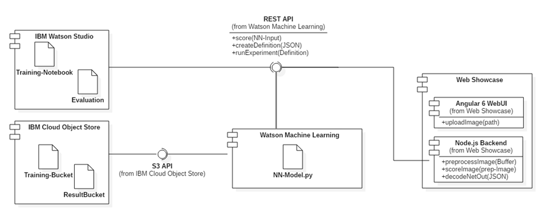

# Technical implementation of medical object detection applications

After the academic introduction into state-of-the-art object detection algorithms, this chapter provides the technical project description form a engineering point of view. The goal of this thesis is to show the capabilities of object detection algorithms for medical use cases. Chapter 2 presented three different possible datasets in different medical exchange formats. An object detection system should provide accurate predictions on different kinds of datasets, like microscopy cell photographs, digital pathology slides or MRI scans. This chapter describes the framework used to evaluate different kinds of datasets with different algorithms.

## Implementation architecture

The use of deep learning in the healthcare industry is growing (figure xy) [@Greenspan.2016, @Miotto.2017, @Ghassemi.2018]. However the focus for most publications is more on the algorithm point of view than the deployment architecture [@Litjens.2017]. Many deep-learning as a service providers <!-- (source) --> have their own concepts to bring DL in enterprises. With few exceptions [@Cho.2017] all these solutions are cloud based. 
Building an architecture that uses custom model models based on latest research, requires at minimum a service or a cluster with the possibilities of GPU training [@Goodfellow.2016, p. 444ff] <!-- cite more from gutfellow chapter -->. The implementation of state-of-the-art object detection algorithms does generally imply that convolutional neural nets are trained on preprocessed data. Training convolutional neural nets is at multiple times faster on special GPU systems [@fig:GPUacc], than on general purpose CPU's [@Strigl.2010, @Shi.2016]. Therefore independently of the deep learning framework the training system requires GPU support to enable an agile and adaptable development of the DL model.
<!-- use more insight from https://ieeexplore.ieee.org/stamp/stamp.jsp?arnumber=7463094 -->

![GPU acceleration for deep learning(based on [@Nvidia.2016, @Nvidia2018])](images/data-center-tesla-v100-inference-performance.png){#fig:GPUacc}

### Implementation using the IBM Cloud

Since the thesis was written in cooperation with IBM Germany, the author had free access to the IBM deep-learning service called Watson Machine Learning  [@IBM.2016]. The following architecture [@fig:arch] is based on the ideas and limitations of this service and was implemented with IBM technology. However since the services do use common interfaces their components are also exchangeable with other services. In it's current implementation the service run completely in the Cloud. <!-- why cloud -->

{#fig:arch}

The core of the architecture is the Watson Machine Learning (WML) [@IBM.2016]. WML is a service on IBM Cloud which provides different deep learning environments with Nvidia Tesla GPU acceleration hardware [@IBM.2015, @Considine.2018]. The service is configurable with different runtimes, frameworks and GPU scaling options [@IBM.2018d]. Configurability is important since different object-detection-model might use different frameworks and other requirements  in computing power. The service provides a REST endpoint for the model training, deployment and the scoring.
Training and deploying existing custom models is easy achievable using a deep learning service. The WML services provides support three common machine learning frameworks: Spark MLlib, scikit-learn and XGBoost. For deep learning WML supports the three most common DL frameworks according to [@Li.2017] : Tensorflow, Keras and Caffe. Additionally models from IBM SPSS together with the Predictive Model Markup Language (PMML) format are supported. Unfortunally with PyTorch another very popular framework is not implemented for now. [@IBM.2018]
This training and deployment is written in Jupiter Notebooks for usability reasons. Over the python client they control the REST API. The notebooks are shared in the cloud using Watson Studio.
The data  is stored separately in a Object Storage using the standardized S3 interface. WML learning requires at least two object storage buckets. One stores the training data, namingly the images and their annotations. The second bucket stores the results for each training run. The buckets behave like folders and they will by mounted like dives and runtime of the WML service. 
Each training run creates a model file. This file can either be downloaded for local use or deployed over a REST endpoint. The endpoint takes the neural network input and predicts an output. Further steps like preprocessing an image or decoding the network output are as for know not part of the model deployment.
To integrate additional processing steps the user has two options implementing this functionality. First option is the use of AI OpenScale which is a enterprise framework using WML for building and managing general AI models [@IBM.2018c]. Alternatively the logic has to be implemented in the end application directly or by an additional layer. AI OpenScale is still in a beta state, to provide a stable solution chapter xy will show the second implementation on different runtimes.
<!-- The is a third currently confidential way: WML is currently integrating a Smart Resource and Operation Management (SROM)[http://ide-research.net/papers/2015_KEIT_SROM_Eng.pdf] into the service. SROM enables the creation of custom pipelines for the WML service [https://github.ibm.com/srom/docs/blob/upcoming/workbooks/experimental/srom_wml/user_guide.md] https://github.ibm.com/srom/docs/blob/master/DLAAS.CHALLENGES.MD https://github.ibm.com/srom/docs/blob/master/SROM_planned_architectural_directions.md hat auch ein richtiges paper http://ide-research.net/papers/2015_KEIT_SROM_Eng.pdf -->

<!-- Model exchanability: https://www.oreilly.com/ideas/deep-learning-in-the-enterprise -->

### Alternative Deep Learning Services

Other companies provide similar services to Watson Machine Learning, such as AWS Deep Learning AMIs [@Amazon.2018], the Google Cloud Machine Learning Engine [@Li.2017b] or Microsoft's Batch AI [@MicrosoftNewsCenter.2017]. The WML service could also be replaced by a virtual machine in the cloud running the deep learning frameworks. The current solution is the most cost efficient under the given circumstances. <!-- Write that amazon is the best? -->

The general advantages of deep-learning services are that most reference implementations provided by the  authors can be deployed directly. This makes the development of cutting edge technology easier to use. If building and developing new models other kinds of services like  neural network modelers provide an alternative [@Microsoft.2018, @Ruiz.2018].

The datasets presented in this thesis are analyzed in low resolution (in maximum 1000 square pixel). Even the high resolution breast cancer slides are analyzed using down sampled patches. This has two reasons, some algorithms do not supported, but commonly the memory of the GPU's is a limiting factor. For supporting larger models without significant loose of scalability on-premise systems, like PowerAI, do provide better solutions. [@Cho.2017]

One may note that Watson Machine Learning is a proprietary software and for some use cases and end-to-end open source solution is required. A very common alternative are Docker and Kubernetes based systems like FloydHub [@FloydHub.2016] or Fabric-for-deep-learning [@Singh.2018, @IBM.2018b]. Training and deploying with these solutions requires virtual machines or bare metal servers. Achieving the same performance with specialized DL systems is more cost efficient than using these systems <!-- anhang procing sheet -->. 

## Analyze and processing of medical datasets

Computer vision tasks like object detection do usually require only a few amount of preprocessing [@Goodfellow.2016, p. xiv], specially for   deep neural networks which use raw images as input. Even tough one of the challenges for applying object detection in the medical field was to actually find datasets annotated with masks or boxes. 

### Image and annotation preparations

This work has explored two completely different kinds of datasets. The first dataset are colored microscopy images of blood cells. The dataset contains 364 images of *640 x 480* size annotated with three classes: Red Blood Cells, White Blood Cells and Platelets. [@Shenggan.2017]
The second dataset was published by the Radiological Society of North America (RSNA) and contains a the publication of this work 25684 annotated grey-scaled images with evidence of lung pneumonia including negative examples. The images are provided in the medical DICOM format with a *1024x1024* resolution. [@RadiologicalSocietyofNorthAmerica.20180821, @RadiologicalSocietyofNorthAmerica.2018]
The thesis additionally explored a third high resolution dataset called CAMELYON17 [@BaidoshviliAlexi.2018, @Bandi.2018]. The dataset contains 127 so called whole-slide scans of breast cancer. Each scan contains images from four different view angles with a resolution about *197tsd x 96tsd* stored in the Philips BigTIFF format [@AperioTechnologies.2007]. <!-- openmicroscopy.com, TODO check format -->

Like in the three dataset examples, data and annotation formats can vary. Even tough neural networks are working on raw images, these images have to be feed over a standard format into the network. Over the time different annotation formats for object detection have been established. The most common formats are Pascal VOC and COCO, derived  from the two most important object detection benchmarks. But some frameworks like Darknet or CNTK did also modify these annotations into new formats. This implementation uses the originally VOC format for annotations. However the workflow should be adaptable and should include the a standard interface to review the data. Therefore all preprocessing scripts transform the data into images and annotations reviewable in a common tagging tool, which does then provide the dataset in the required annotation format.

The work review several tools for annotating including the  Pascal VOC Dataset Manager [@UniversityofInsubri.2013], the COCO Annotation UI [@Lin.2014, @Lin.2015], the COCOstuff Matlab annotation tool [@Caesar.2016, @Caesar.2016b] OpenLabeling [@Cartucho.2018], and the Visual Object Tagging Tool (VoTT) [@Microsoft.2018c]. For reviewing bounding box annotations VoTT found to be the best. 
Using VoTT also large datasets can be reviewed easily. VoTT supports active tracking of objects in partly annotated videos over the the hole scene using the CamShift algorithm [@Bradski.1998], enabling faster annotations. Especially when using different deep learning algorithms or frameworks the export feature of VoTT does help to export the tags into different annotation formats. Although it should be said that the export of large datasets does not work for in the current versions of VoTT [@Pinho.2018] which does still require manual scripts.
Each dataset is modular included into the pipeline by writing a script to transform the images into a VoTT compatible review format. This format consist of a folder with JPEG images and a JSON file containing all annotations. This format of images is used as well by the data augmentation scripts for datasets not matching deep learning requirements. 

### Deep Learning preparation

Like the first or the third dataset, most datasets are pretty small, which is challenging for training neural networks.  There are two ways addressing this issue transfer learning and data augmentation. The thesis prototype uses both techniques to improve the accuracy of predictions. 

The deep learning model uses the experience received on the ImageNet dataset. The convolutional modules of the new network are initialized to the trained weights of the ImageNet dataset. How transfer learning can be applied to convolutional neural networks has been show, right after the their breakthrough for image classification in  2012 between [@Oquab.2014]. Shin et al. [@Shin.2016] showed that transfer learning from ImageNet improved the results for lung CT slices like the second dataset. By their usage many shapes of objects where  already recognizable for the network.   Cruz-Roa et al. [@CruzRoa.2015] has previously shown the same also for colored pathology slices, like the images of the first and third dataset.  Even thought the current transfer learning could be improved by applying some techniques like Pruning [@Molchanov.2016]. The current implementation does still use the complete weights of ImageNet for initialization.

Data Augmentation on the other hand is also common way to increase the amount of images and simultaneously reducing the generalization error as well is data augmentation [@Goodfellow.2016, p. 453]. This thesis implements the data augmentation strategies proposed for object detection by SSD network [@SSD]. This augmentation strategies include two kinds of transformations. Geometric transformation include resizing, rotations and image deformation. The photometric transformations change the image in color, brightness or add some kind of noise. The implementation reuses already existing libraries such as transforms [@uoip.2018] and imgaug [@Jung.2018].

## Discussion of deep learning frameworks

The current training service does officially support five different deep learning frameworks [@IBM.2018]. IBM internally supports also other common frameworks. This being said makes the choice of the framework independent of the training environment. The implementation of different networks in different frameworks would also be possible. However the framework should be capable to use the full potential of modern hardware. For the WML service multi-GPU support and CUDA integration should be available. It is also always good to have an efficient framework. Different benchmarks provide very different results, but PyTorch, CNTK, Caffe and TensorFlow are commonly better performing for convolutional neural networks [@Shi.2016, @HongKongBaptistUniversityHeterogeneousComputingLab.2017]. Additionally special frameworks like NVIDIA TensorRT [@Nvidia.2016b] or IBM Distributed Deep Learning [@Cho.2017] perform even better, but are not supported in the current training environment. Another disadvantage of these two together with the Microsoft Cognitive Toolkit (CNTK) are that they are pretty new and not broadly adopted in the deep learning community for now. The lack of a broader amount of reference implementations makes a new neural network harder to implement. In terms of code reusability the Caffe framework with it's model zoo is the best. 

The deep learning framework goal of this thesis was to use a easily understandable frameworks, enabling simple adoption for new medical use cases. The tool of choice has therefore been Keras,  a high level interface for deep learning algorithms. Keras has multiple advantages. The framework abstracts a lot of complexity of deep learning modules into a simple Python interface, making prototyping easy and fast. It has support for multiple different kinds of hardware such as NVIDIA GPUs, Google TPUs or OpenCL-enabled GPUs, which makes the framework very independent upon the underlying deep learning service. Keras provides already tools for monitoring and the visualization of the framework such as Tensorboard. The Keras framework has already been integrated in various application frameworks like the Apple CoreML, the TensorFlow Android runtime, Java Virtual Machine applications or JavaScript based frontend interfaces. Keras do run on different underlying deep learning frameworks such as Theano, TensorFlow or CNTK. This implementation uses a TensorFlow backend. Even tough Keras belongs not to the fastest implementations, the use of these backends do provide a robust performance. 
Since Keras runs is easy to use, runs on different platforms and has been integrated in various applications, it does help to apply this work into medical applications and workflows.

## Description of the machine learning model

under construction ...<!--Ziel der Arbeit ist die Klassifikation von Zellen bzw. Bildern durch Machine Learning bzw. Deep Learning. Dieses Kapitel beschreib wie das verwendete Modell für das ML aussieht, worauf Schwerpunkte gelegt wurden und was Stärken und Schwächen dieses Modells sind. Diese Kapitel stellt zudem die Ergebnisse der Date-Evaluierungen vor welche zu diesem Modell geführt haben.-->

## Punctually description of implementation aspects

<!--Final werden in diesem Kapitel die punktuell wichtigen Punkte der Implementierung besprochen, welche für die Umsetzung der Anwendung relevant waren -->still missing ...
